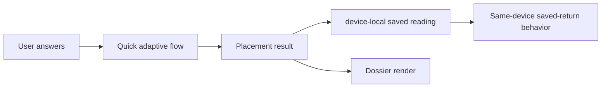

# Data Flow Map

This document traces the main Vox Mana data paths from source content through generated runtime artifacts, browser state, backend calls, and local tooling.

## Faction And Placement Artifacts

| Source | Transform | Output | Consumer |
|---|---|---|---|
| `data/identity-layers.json` | Local faction artifact builder validates color and expression metadata, then merges it into runtime identity blocks. | `data/factions.json`, `data/placement-model.json`, `data/placement-model.schema.json`, retained generated `faction-context.ts` comparison projection | Dossier rendering, adaptive reading, producer audits, and deterministic comparison validation. |
| `data/raw-factions/*/*.profile.json` | Local faction artifact builder reads faction identity, profile, source, and claim metadata. | `data/placement-model.json`, retained generated `faction-context.ts` comparison projection | Adaptive reading plus current producer/audit/validation consumers. |
| `data/raw-factions/*/*.placement.json` | Build script normalizes calibration, good/poor indicators, discriminator questions, and lateral inhibition targets. | `data/placement-model.json` | `assets/js/archscry/adaptive-placement.js`. |
| `data/factions.json` | Build script enriches `_meta` while preserving display data. | `data/factions.json` | `assets/js/archscry/runtime/data.js` loading and `runtime/dossier-view.js` rendering. |
| Build-time constants in `scripts/build/build-faction-artifacts.mjs` | Raw ids map to runtime keys, biological priors, known inhibition, question bank, schema. | `data/placement-model.json`, `data/placement-model.schema.json`, `supabase/functions/guild-recruiter/faction-context.ts` | Frontend plus current producer/audit/validation tooling; the historical namespace is temporary. |

The authoritative edit path is raw/display data first, then `npm run build:factions` from this repo. Generated artifacts should not be hand-edited unless explicitly repairing generated output.

The current live placement pipeline still operates without a runtime `domain` field. The active placement set is the original 20-expression Ravnica/Strixhaven/mono Home preview baseline plus five live Alara shard pilots and five live wedge pilots, with the baseline-domain decision documented as `ravnica_strixhaven` in [Placement Domains](placement-domains.md). Khans and New Capenna remain future post-v1 architecture only, and no live build step currently reads or emits a `domain` field.

## Precon Recommendation Artifacts

| Source | Transform | Output | Consumer |
|---|---|---|---|
| `data/precons/reference/vox_mana_precon_mechanics_validation_all_155_completed.xlsx` | `scripts/build/import-precon-mechanics-validation.mjs` reads the first preferred sheet with all required columns, validates 155 keyed rows, and updates only `mechanics` plus nullable `creatureTypeFocus`. | `data/precons/vox-mana-precons.source.json` | Staging/reference import only; never browser runtime input. |
| `data/precons/vox-mana-precons.source.json` | `scripts/build/build-precon-artifacts.mjs` validates source metadata, score ranges, and color identities. | `data/precons/vox-mana-precon-catalog.json`, `data/precons/vox-mana-precon-catalog.schema.json` | Archscry dossier precon recommendations. |
| `data/taxonomy/vox-mana-precon-themes.json` | Precon artifact builder resolves normalized theme keys, aliases, reading tags, and table-perception language. | `data/precons/vox-mana-precon-catalog.json` | Archscry dossier ranking and card copy. |

The authoritative edit path is `data/precons/vox-mana-precons.source.json` plus `data/taxonomy/vox-mana-precon-themes.json`, then `npm run build:precons`. The completed mechanics workbook is a staging artifact only; after import, the canonical JSON remains the source of truth. The browser should not read directly from archived research docs or XLSX reference files.

## Browser Runtime State

| Data | Owner | Storage | Purpose |
|---|---|---|---|
| `APP_STATE` | `assets/js/archscry/runtime/state.js` | In-memory only | One shared object with established identity/defaults/mutation semantics for factions, model, catalogs, quick answers, adaptive state, active result/view, and starter profile. |
| `VM_READING_STATE` | `assets/js/shared/shared.js` | In-memory only | Current normalized reading used by Archscry and Maze during the page lifecycle; it is not a second persistent authority. |
| Saved placement result | `assets/js/shared/shared.js` | `localStorage` key `vm_archscry_saved_reading_v1` | Latest complete Archscry reading for direct same-browser/device dossier return. A legacy session cache is migrated once when found. |
| Archscry telemetry reading run | `assets/js/shared/vox-telemetry.js` | In-memory only | Correlates one reading start, its accepted answer IDs, and its first completed result. It is not persisted or used as a person identifier. |
| Field Guide telemetry session | `assets/js/shared/vox-telemetry.js`, `assets/js/guide/guide-telemetry.js` | In-memory only | Correlates bounded Guide open, active-time threshold, intentional action, and walkthrough lifecycle events for one page load. It is not persisted or placed in a URL. |
| Reduce motion | `assets/js/shared/reduce-motion.js`, `assets/js/shared/vm-topbar.js` | `localStorage` key `vm_reduce_motion` | Shared motion preference. |
| Home atmosphere | `assets/js/home/home.js` | Route-local runtime state | Renders current stars/orbs, maintains pointer atmosphere variables, honors reduced motion and visibility changes, and owns back-to-top behavior. |
| Archscry-to-Maze handoff | Approved `data/dossier/identity-dossier-content.source.json` meaning -> authored `data/dossier/maze-discovery-profiles.source.json` query projection and lane boundaries -> `scripts/build/build-maze-discovery-profiles.mjs` -> generated discovery catalog -> shared `assets/js/maze/maze-handoff.js` factory -> Archscry links and Maze context UI | Normal reading context uses `localStorage` key `vm_archscry_maze_handoff_v1` plus Maze query params. Public `identity-explore` and local `dossier-review` contexts are query-carried and in-memory only. | Preserves originating dossier, active fit, faction name, return URL, `plainReadingQuery`, executable `operatorQuery`, stable `pathType`, source-governed semantic threads, and honest lane-specific unavailable explanations. Explicit transient identity context wins over a stale saved-reading handoff without writing, replacing, or claiming a placement. Archscry and Maze consume one catalog and one factory rather than maintaining separate definitions. |
| VM-547 projection QA | Generated discovery catalog + pinned `data/scryfall/raw/oracle-cards.json` -> `scripts/audit/vm547-projection-audit.mjs` -> `tests/fixtures/vm547-projection-card-fixtures.json` + all-367 review evidence | Checked-in deterministic QA artifacts only; no browser or runtime persistence. | Covers all 367 lane projections with local result viability and card-level positive, plausible semantic-negative, and boundary fixtures. It blocks executable zero-result projections, broad-primitive drift, false conjunction labels, and named prior false positives without affecting result ranking or runtime search generation. |
| Public Identity Atlas route state | `assets/js/archscry/runtime/identity-directory.js`, `assets/js/archscry/runtime/identity-atlas.js`, `assets/js/archscry/index.js` | URL-only `?explore=atlas` or `?explore=<slug>` state; no Atlas persistence key. | Projects the active 37-entry identity/faction registry into native dossier links and opens the accepted identity-only renderer. Explicit exploration wins over passive saved-reading restoration while the saved reading remains untouched. |
| Maze Reading Finds | `assets/js/maze/maze-scratchpad-store.js`, `assets/js/maze/research-init.js`, `assets/js/archscry/runtime/dossier-controls.js` | `localStorage` key `vm_maze_reading_finds_v1`, with read-only migration from `vm_maze_deck_idea_v2` and `vm_maze_card_stash_v1` | Local reading companion with Finds, Sparks, and Anchors sections, quantity grouping, readingId-filtered Archscry reflection inside Maze Discovery, plain-text finds export, and no account persistence. |
| Command panel filters | External command panel | `localStorage` keys `cp.*` | Local panel lane/status/search/page preferences. |

## Placement Result Flow

All result-producing paths should converge on the versioned placement shape documented in [Data Contracts](../reference/data-contracts.md).

The mono foundation pass adds layered `identity` blocks to primary and adjacent matches. `color_weights` remains optional until scoring can produce it without approximation.

Future domain selection should be inferred from placement inputs and results rather than exposed as an upfront selector. That behavior is not implemented in the current pipeline.

## External Services

| Service | Caller | Endpoint family | Data sent | Data received |
|---|---|---|---|---|
| Scryfall Search | `assets/js/maze/research-search.js` | `/cards/search` | Query, unique, order, page | Card result pages and pagination URLs. |
| Scryfall Named | `assets/js/maze/research-search.js`, `assets/js/archscry/runtime/card-media.js` | `/cards/named` | Fuzzy card name | Exact card detail or image/link metadata. |
| Scryfall Random | `assets/js/maze/research-search.js` | `/cards/random` | Optional query | Random fallback/no-results card. |
| Web3Forms | `assets/js/shared/vm-feedback.js` | `https://api.web3forms.com/submit` | Feedback text, optional reply email, page/path/visible-section context, simplified browser/device label, viewport, timestamp, and an hCaptcha token only when configured | Submission success or error status; no application-state mutation beyond feedback UI state. |
| PostHog Cloud US | `assets/js/shared/vox-telemetry.js`, initialized by `assets/js/archscry/index.js` and `assets/js/guide/guide-telemetry.js` | `/static/1/array.js`, US ingestion endpoint | Three allowlisted Archscry funnel events and four allowlisted Field Guide events containing bounded structured properties and ephemeral in-memory session IDs | Product analytics ingestion only; no runtime response changes placement, Guide behavior, or rendering. |

## Device-Local Reading Persistence

`assets/js/shared/shared.js` stores the complete normalized result under `vm_archscry_saved_reading_v1`. The browser renders that result directly on return, so no account, request, or profile row is involved. Clearing that exact reading or using another browser/device does not restore it; account-backed recovery is retired product scope.

## Research Workspace Data

| Source | Transform | Output |
|---|---|---|
| `data/maze/scryfall-parser-seed-2026.json` | `createDictionaryFromSeed` expands triggers into dictionaries; `getScryfallDictionaryVocabulary` exposes local terms. | Runtime parser dictionary plus deterministic keyword, subtype, card type, and format vocabulary. |
| Natural language input | `parseScryfallNaturalLanguage` | Structured query, reason, confidence, warnings, assumptions, alternatives. |
| Maze query request | `assets/js/maze/research-init.js` `doSearch()`, `runQuickSearch()`, and route-seeded launch adapters -> `assets/js/maze/maze-query-core.js` | Contract-shaped `MazeQueryResult` with executable query, parser mode, `MazeDiagnostic[]`, normalized API metadata, and source context. Route adapter still executes fetch/render/storage behavior. |
| Raw syntax input | `prepareRawSyntaxQuery` in the Maze query core | Cleaned query and optional OR alternative diagnostics. |
| Visual Builder filters | `buildVisualBuilderQuery` | Scryfall query fragments for color, type, format, rarity, mana value, and keywords. |
| Future cross-mode Maze meaning | `data/maze/maze-semantic-state-v1.schema.json` plus `docs/contracts/maze-semantic-state-contract.md` | Dormant VM-591 contract for preserving hard/soft constraints, Boolean structure, explicit color relations, context application, lenses, conflicts, unresolved terms, query candidates, display forms, and recommendation signals. No production runtime imports it; `MazeQueryResult.query` remains the sole executable query. |
| Scryfall responses | `research-init.js` render helpers | Result grid, modal detail, no-results state, recent searches. |

## Scryfall Bulk And Discovery Data

| Source | Transform | Output |
|---|---|---|
| Scryfall `/bulk-data` endpoint | `scripts/download-scryfall-bulk.mjs` selects `oracle_cards`, validates JSON, and writes ignored raw files. | `data/scryfall/raw/oracle-cards.json`, `data/scryfall/raw/bulk-manifest.json` |
| `oracle-cards.json` plus `data/taxonomy/vox-mana-tags.json` | `scripts/build-scryfall-indexes.mjs` emits categorized tags, lore tones, Commander candidates, color summaries, and mechanic summaries. | `data/scryfall/indexes/*.json` |
| `card-flavor-index.json` | Archscry result helpers select short flavor echoes by color identity, reading tags, and lore-tone fit. | Flavor Echoes result section with Scryfall links and "why it echoes" copy. |
| `commander-index.json` | Archscry Commander preview enrichment checks local metadata after curated Commander Compass candidates are selected. | Commander type/color/tag metadata beside preview cards. |
| `data/precons/vox-mana-precon-catalog.json` plus `data/taxonomy/vox-mana-precon-themes.json` | Archscry dossier helpers derive faction-native exact, other exact, and stretch recommendations from the active dossier view, reading tags, starter profile, and curated `factionRefs`. | `Recommended Precon Decks` subsection inside the `Commander Deck Starts` panel. |
| Device-local v1 reading, persistent Archscry handoff, or explicit transient identity context plus the generated 37-profile discovery catalog | The shared Maze handoff factory derives a broad exact-identity commander pool, three identity-specific mechanical threads for commander/support/stretch searches, a flavor/story vocabulary thread, and an explicit stretch boundary. Archscry-originated links and Maze sidebar paths seed Plain Reading display text from `plainReadingQuery` while executing `operatorQuery`. An explicit `identity-explore` or `dossier-review` identity wins over stored placement context; otherwise an active handoff fit wins before fallback to the saved primary placement. | Compact Archscry `Maze Discovery Paths`; expanded Maze `From your dossier` reading/thread/interpretation/query-inspection chain; live Scryfall results; context-appropriate return copy; and a dismissible return-to-dossier banner. Public exploration creates no placement or Reading Finds association and returns to the browsed identity URL. WUBRG shows no executable outside-color lane because none can be truthful. |

## Command Panel Data

| Data | Location | Owner |
|---|---|---|
| Command manifest | External tools workspace | Local command allowlist. |
| External Apocrypha dry-run report | `C:\dev\projectFiles\lore\.cache\apocrypha-digest\research\apocrypha-index\dry_run_report.json` | Command panel inventory import. |
| External source manifest | `C:\dev\projectFiles\lore\.cache\apocrypha-digest\research\apocrypha-index\source_manifest.json` | Command panel inventory import. |
| Persistent panel state | `C:\dev\projectFiles\voxmana-tools\test-results\command-panel\state.json` | Selected/reviewed/skipped/running inventory states. |
| Run logs | `C:\dev\projectFiles\voxmana-tools\test-results\command-panel\runs\` | stdout/stderr/run records for command executions. |

## Test And Report Outputs

| Command | Output |
|---|---|
| `npm test` | Console PASS/FAIL for parser, builder, mode, syntax, and placement tests. |
| `node scripts/build/import-precon-mechanics-validation.mjs` | Imports the completed 155-row precon mechanics workbook into canonical source JSON with duplicate-key, validation-status, mechanics-shape, nullable focus, and protected-field guards. |
| `npm run build:precons` | Rebuilds the generated precon recommendation catalog and runtime schema from the canonical precon source plus theme taxonomy. |
| `npm run test:placement` | Console PASS/FAIL for adaptive model invariants and golden paths. |
| `npm run test:bias` | Writes seeded-random bias report under `test-results/quick-reading-bias/`. |
| `npm run test:bias:all` | Writes exhaustive/golden bias report under `test-results/quick-reading-bias/`. |
