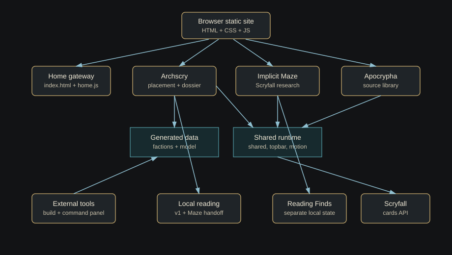
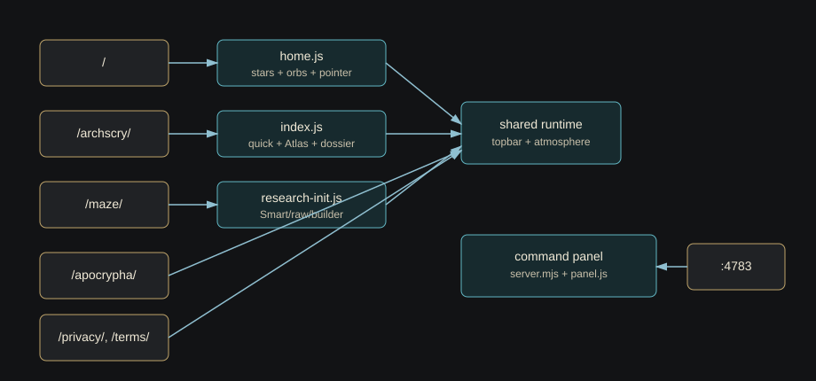
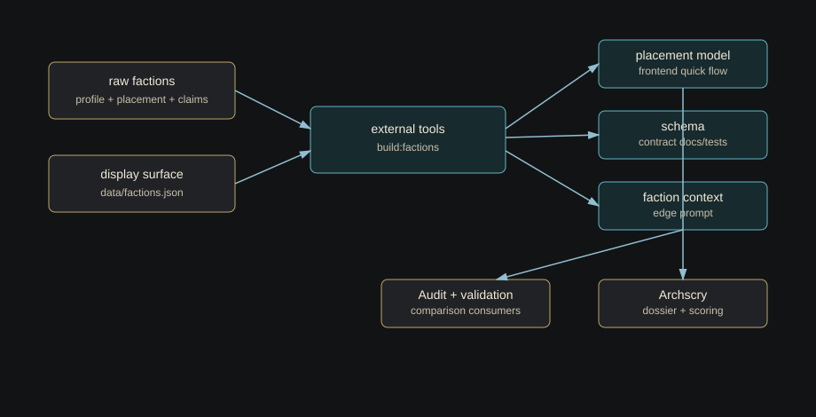
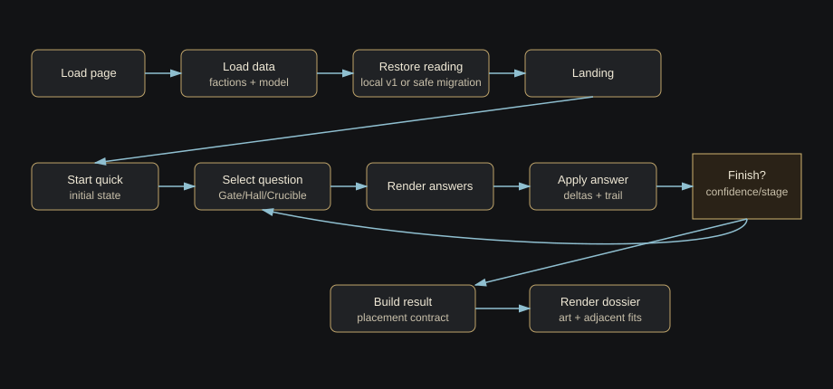

# Diagrams

The Mermaid files are the editable diagram sources. The SVG files are static companions for quick browsing and sharing. Keep each `.mmd` and `.svg` pair conceptually aligned when changing architecture, routes, data flow, or runtime ownership.

| Diagram | Mermaid Source | Static SVG |
|---|---|---|
| Project architecture | [project-architecture.mmd](project-architecture.mmd) | [project-architecture.svg](project-architecture.svg) |
| Route map | [route-map.mmd](route-map.mmd) | [route-map.svg](route-map.svg) |
| Data pipeline | [data-pipeline.mmd](data-pipeline.mmd) | [data-pipeline.svg](data-pipeline.svg) |
| Archscry quick flow | [archscry-quick-flow.mmd](archscry-quick-flow.mmd) | [archscry-quick-flow.svg](archscry-quick-flow.svg) |
| Maze Scryfall flow | [maze-scryfall-flow.mmd](maze-scryfall-flow.mmd) | [maze-scryfall-flow.svg](maze-scryfall-flow.svg) |
| Command panel flow | [command-panel-flow.mmd](command-panel-flow.mmd) | [command-panel-flow.svg](command-panel-flow.svg) |

## Project Architecture

## Route Map

## Data Pipeline

## Archscry Quick Flow

## Maze Scryfall Flow

## Command Panel Flow

