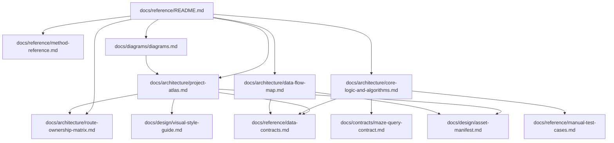

# Spec Index

This index explains the existing documentation set and how it connects to the technical atlas.

| Spec | Role | Use When |
|---|---|---|
| [README](./README.md) | Developer docs hub for the atlas. | Orienting to the documentation set. |
| [Project Atlas](../architecture/project-atlas.md) | High-level system map. | Finding routes, entrypoints, scripts, runtime layers, and artifacts. |
| [Route Ownership Matrix](../architecture/route-ownership-matrix.md) | Per-route ownership and dependency map. | Checking page purpose, CSS/JS ownership, storage keys, external services, tests, risks, and do-not-touch boundaries before frontend work. |
| [Method Reference](./method-reference.md) | Javadoc-equivalent function/API list. | Looking up functions, exports, globals, handlers, and endpoint surfaces. |
| [Core Logic And Algorithms](../architecture/core-logic-and-algorithms.md) | Behavioral breakdowns. | Understanding placement, parsing, persistence, generation, and command execution logic. |
| [Data Flow Map](../architecture/data-flow-map.md) | Data lineage and storage map. | Tracing raw inputs to generated artifacts, device-local browser state, Scryfall calls, and test output. |
| [Supabase Frontend Security Review](../architecture/supabase-frontend-security-review.md) | Historical security review superseded by VM-656 product retirement. | Understanding why the former browser/account/function surfaces were removed; not a reactivation plan. |
| [Maze Query Contract](../contracts/maze-query-contract.md) | VM-022 query contract. | Changing Maze parsing, raw syntax normalization, builder query generation, Archscry/path launches, or query-core ownership boundaries. |
| [Diagrams](../diagrams/diagrams.md) | Visual maps. | Reading architecture, route, flow, and data diagrams. |
| [Data Contracts](./data-contracts.md) | Runtime data shapes. | Updating placement result shape, generated model shape, or device-local saved-reading behavior. |
| [Manual Test Cases](./manual-test-cases.md) | Human QA flow. | Verifying quick reading, local restore/migration/Forget, failures, and mobile sanity. |
| [Visual Style Guide](../design/visual-style-guide.md) | Art direction and UI language. | Creating or refactoring pages/assets without losing the Vox Mana aesthetic. |
| [Asset Manifest](../design/asset-manifest.md) | Asset source and generation queue. | Regenerating backgrounds, textures, overlays, icons, or architecture fragments. |
| [Implementation Notes](../design/implementation-notes.md) | Asset implementation notes. | Applying generated assets through CSS and component classes. |
| [Move Into Repo](./move-into-repo.md) | Migration note. | Checking what was moved into this repo during earlier consolidation. |
| [Workflow](./workflow.md) | Kanban and PR review workflow. | Opening issues, branches, PRs, and local review passes. |

## Spec Dependency Map

## Maintenance Rules

- Update [Method Reference](./method-reference.md) when adding, removing, or renaming named functions, exported constants, globals, or local endpoints.
- Update [Data Flow Map](../architecture/data-flow-map.md) when generated artifacts, storage keys, or external APIs change.
- Update [Route Ownership Matrix](../architecture/route-ownership-matrix.md) when public route HTML, CSS stacks, JS entrypoints, browser storage keys, generated-file usage, external services, smoke/manual tests, or do-not-touch boundaries change.
- Update [Core Logic And Algorithms](../architecture/core-logic-and-algorithms.md) when placement scoring, parser rules, query-builder behavior, saved-reading behavior, or command execution changes.
- Update [Maze Query Contract](../contracts/maze-query-contract.md) before changing Maze query request/result shapes, path-entry semantics, or ownership boundaries.
- Update [Diagrams](../diagrams/diagrams.md) and the matching `docs/diagrams/*.mmd` and `*.svg` files when route, data, or runtime boundaries change.
